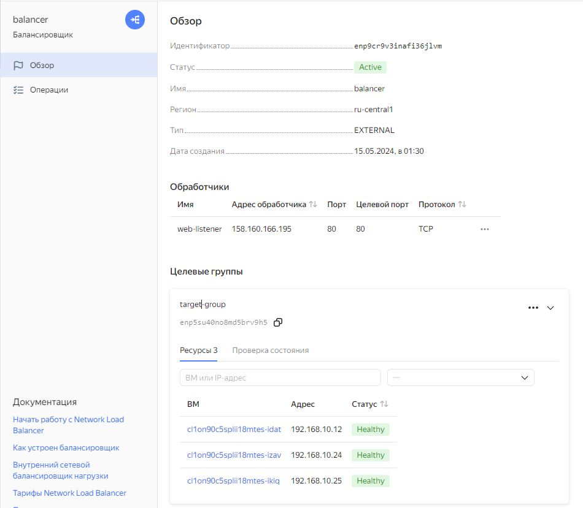
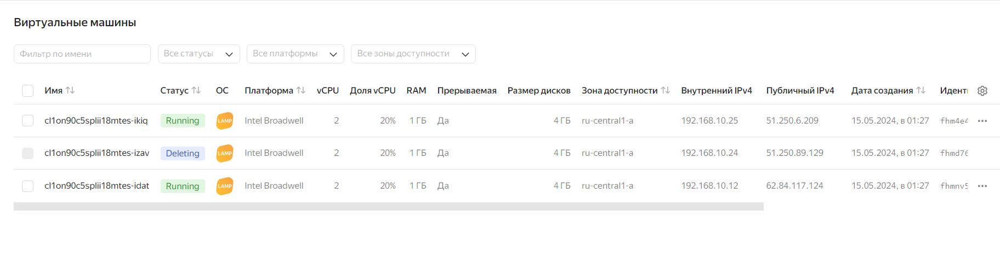
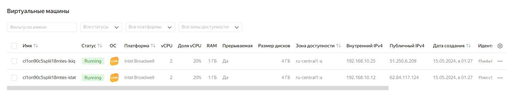
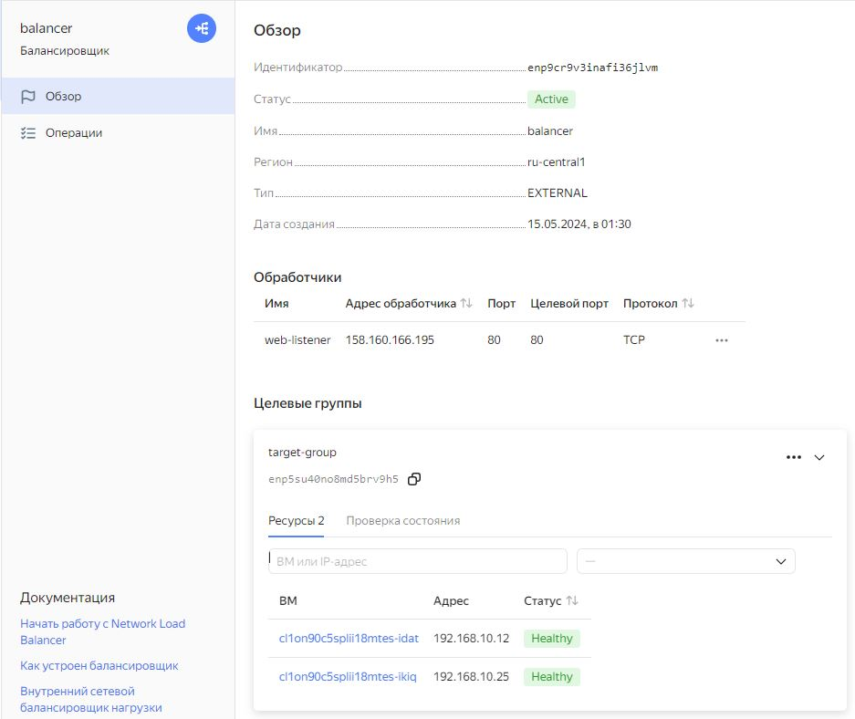

# Домашнее задание к занятию "15.2 "Вычислительные мощности. Балансировщики нагрузки" - Баранков Антон"

### Задание 1. Яндекс.Облако

1. Создать bucket Object Storage и разместить там файл с картинкой:
- Создать bucket в Object Storage с произвольным именем (например, имя_студента_дата);

- Положить в bucket файл с картинкой;

- Сделать файл доступным из Интернет.

[Публичная ссылка](https://storage.yandexcloud.net/anton-14052024/111.jpg)

2. Создать группу ВМ в public подсети фиксированного размера с шаблоном LAMP и web-страничкой, содержащей ссылку на картинку из bucket:
- Создать Instance Group с 3 ВМ и шаблоном LAMP. Для LAMP рекомендуется использовать image_id = fd827b91d99psvq5fjit;

- Для создания стартовой веб-страницы рекомендуется использовать раздел user_data в meta_data;
- Разместить в стартовой веб-странице шаблонной ВМ ссылку на картинку из bucket;
- Настроить проверку состояния ВМ.

3. Подключить группу к сетевому балансировщику:
- Создать сетевой балансировщик;
- Проверить работоспособность, удалив одну или несколько ВМ.

[Файл provider.tf](./img/provider-.tf)  

[Файл main.tf](./img/main-.tf)  

[Файл variables.tf](./img/variables-.tf)
