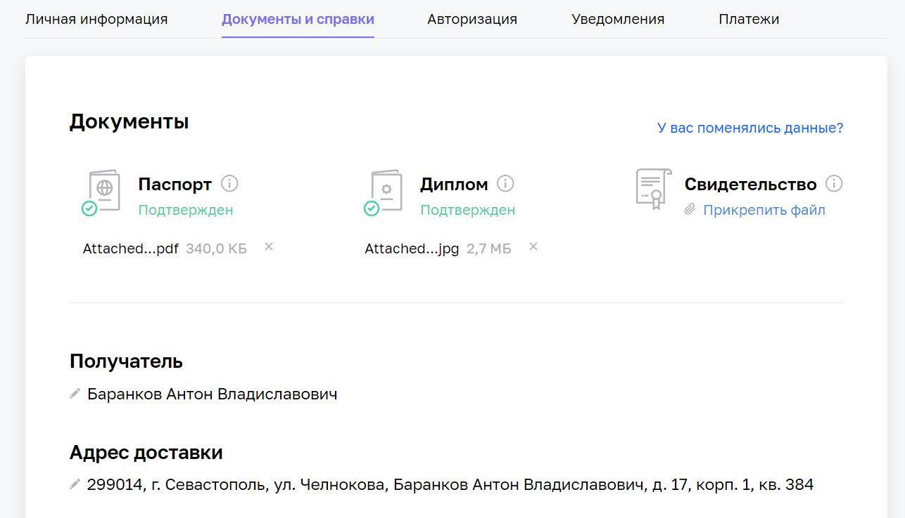

# Домашнее задание к занятию "15.1. Организация сети" - Баранков Антон"

### Задание 1. Подготовить Helm-чарт для приложения
1. Создать VPC.  
- Создать пустую VPC. Выбрать зону.  

2. Публичная подсеть.  
- Создать в vpc subnet с названием public, сетью 192.168.10.0/24.  
- Создать в этой подсети NAT-инстанс, присвоив ему адрес 192.168.10.254. В качестве image_id использовать fd80mrhj8fl2oe87o4e1.  
- Создать в этой публичной подсети виртуалку с публичным IP и подключиться к ней, убедиться что есть доступ к интернету.  

3. Приватная подсеть.  
- Создать в vpc subnet с названием private, сетью 192.168.20.0/24.  
- Создать route table. Добавить статический маршрут, направляющий весь исходящий трафик private сети в NAT-инстанс.  
- Создать в этой приватной подсети виртуалку с внутренним IP, подключиться к ней через виртуалку, созданную ранее и убедиться что есть доступ к интернету.  

[Файл provider.tf](./img/provider.tf)  

[Файл main.tf](./img/main.tf)  

[Файл variables.tf](./img/variables.tf)

